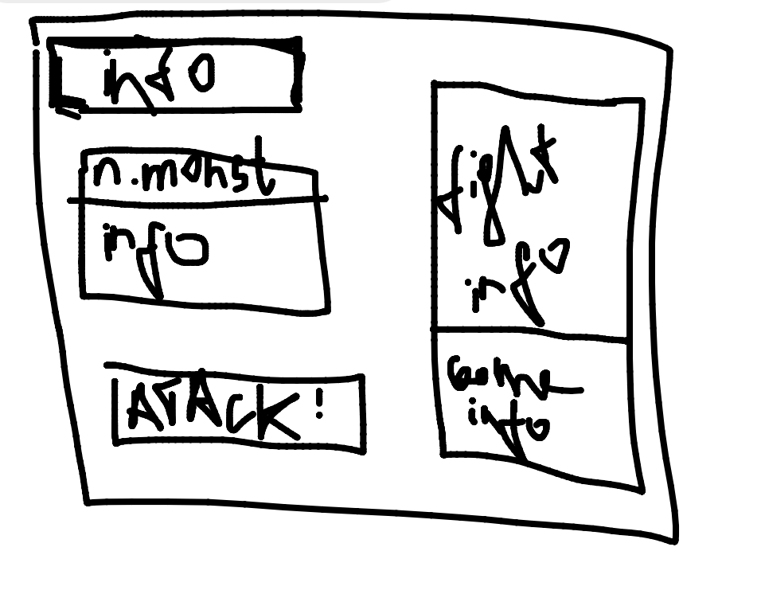

название игры "герой и дракон"

#! цель игры убить дракона
#! идея игря - простоя игра реализована через модуль tkinter
#! игровой интерфейс [[]]

игровой процесс
    (весь бой построе на рандоме
                            нанесение критического урона
                            блокирование урона
                                        полностью или частично)
    начало игры / ввод именя героя
    инициалтцзация первого врага (червь, крыса, мыша ...)
    происходит бой через клик на кнопку "атака"
    в окнах с информацией показанны инофрмация
        % окно с инофрмацией боя кто кого атаковал и и какой урон получид 
        % окно с информацией про характеристики персонажа
    в случае победы герой востанавливает свое полное хп + 5 
    инизицализация нового противника
    финальный бос это дракон 

герой:
    100 xp
    1 lvl
    сила атаки определяется 5 * LVL
    герой получает опыт за убийство монстров
    после повышения уровня полностью востанавливает хp
    после повышения уровня усиливается сила атаки

монстер:
    xp, атака - зависит от класса существа
    доступны возможности
            нанесение критического урона ( не все монстры)
            блокирование урона полостью ( не все монстры)
            блокирование урона частично ( не все монстры)
            шанс двойного удара ( не все монстры)
            регенерация здоровья(не все монстры)

общие возможности героя и монстров
       # возможности
        шанс заблокировать урон (полностью)
        шанс заблокировать урон (наполовину)
        шанс нанести критический урон = урон * 1.5
        шанс двойного удара

игровой интерфейст 
    подвижная полоска хп для мостров и героя 
    подвижная полоска для опыта 
    показан уровень героя
    есть кнопка атаковать 
        после атаки сразу следует атака монстра
    есть текстовое окно связанное с боевкой
        <name_hero> атаковал <name_moster>
            ?? info block atack
                    block oll damage
                    block 1/2 damage
        <name_moster> получил <?> урона
        <name_moster> атаковал <name_hero>
            ?? info block atack
                        block oll damage
                        block 1/2 damage
        <name_hero> получил <?> урона
    текстовое окно с информацией о характеристиках героя/монстра
        окно должно постоянно обновляться при каждом новом бое
            ифнормация
                уровень героя
                атака героя 
                имя монстра
                атака монстра

